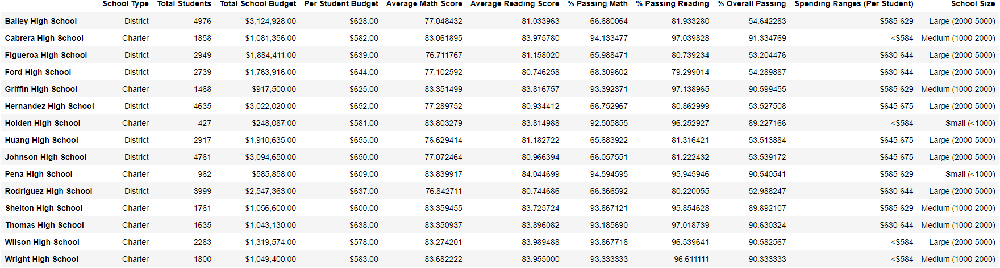
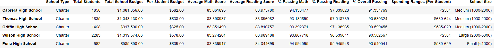
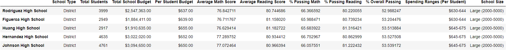
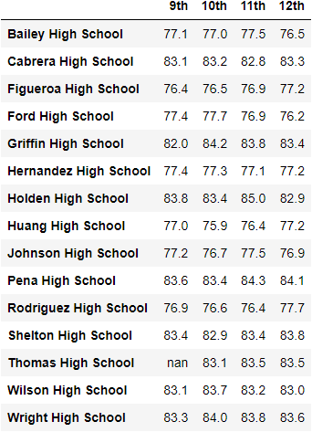
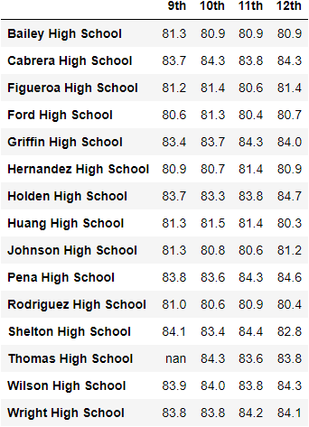
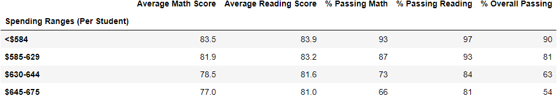
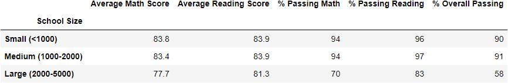
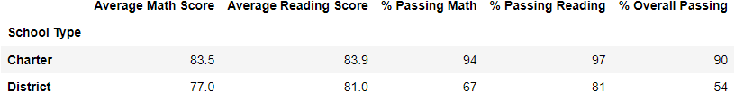

# Scchool District Analysis

## Project Overview
A School Board members have asked for assistance to make budgeting decsions based on different performance outcomes. Thomas High School's 9th grade class showed evidence of academic dishonesty and will therefore these test score data will be removed for this analysis. The following dataframes were used for this analysis. 
1. District Summary for all 15 schools.
2. School Summary.
3. Top 5 and bottom 5 schools, based on overall passing percentage. 
4. Average math and reading scores by grade for each school.
5. The scores by school spending per student, by school size, and by school type.

## Resources 
- Data Sources: 
  - schools_complete.csv
  - students_complete.csv        
- Software: Python 3.7.10, Anaconda 4.10.1

## Challenge Results
- District Summary:

- School Summary:

- Top Performing Schools

- Bottom Performing Schools

- Math Scores by Grade

- Reading Scores by Grade

- Scores by School Spending

- Scores by School Size

- Scores by School Type

## Challenge Summary

