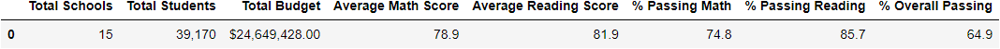

# Scchool District Analysis

## Project Overview
A School Board members have asked for assistance to make budgeting decsions based on different performance outcomes. Thomas High School's 9th grade class showed evidence of academic dishonesty and will therefore these test score data will be removed for this analysis. The following dataframes were used for this analysis. 
1. District Summary for all 15 schools.
2. School Summary.
3. Top 5 and bottom 5 schools, based on overall passing percentage. 
4. Average math and reading scores by grade for each school.
5. The scores by school spending per student, by school size, and by school type.

## Resources 
- Data Sources: 
  - schools_complete.csv
  - students_complete.csv        
- Software: Python 3.7.10, Anaconda 4.10.1

## Challenge Results
District Summary:

## Challenge Summary

A 'counties' list was decalred and used to tally county votes within the same loop tracking candidate counts:

        #Write an if statement that checks that the county does not match any existing county in the county list.
        if county_name not in counties:

            # Add the existing county to the list of counties.
            counties.append(county_name)

The list was added to a dictionary to begin tracking the count:
            
            # Begin tracking the county's vote count.
            county_votes_dict[county_name] = 0

        # Add a vote to that county's vote count.
        county_votes_dict[county_name] += 1
        
This same method could be used to determine count based on demographical data, such as political party or ethnicity, should that be provided. Simply create a new list and index beginning with zero and iterate within the same 'for' loop:

    # Candidate Options and candidate votes.
    candidate_options = []
    candidate_votes = {}
    # For each row in the CSV file.
    for row in reader:

        # Add to the total vote count
        total_votes = total_votes + 1

        county_turnout_votes = county_turnout_votes + 1
        # Get the candidate name from each row.
        candidate_name = row[2]

        # 3: Extract the county name from each row.
        county_name = row[1]
    
        # If the candidate does not match any existing candidate add it to
        # the candidate list
        if candidate_name not in candidate_options:

            # Add the candidate name to the candidate list.
            candidate_options.append(candidate_name)

            # And begin tracking that candidate's voter count.
            candidate_votes[candidate_name] = 0

        # Add a vote to that candidate's count
        candidate_votes[candidate_name] += 1

        etc.
        
The printing script can also be ammended to include additional information, would just require to define additional conditions under the if statement within the same for loop 
           
    # Print the county with the largest turnout to the terminal.
    largest_county_turnout = (
        f"-------------------------\n"
        f"Largest County Turnout: {county_highest_turnout}\n"
        f"-------------------------\n")
    print(largest_county_turnout)

